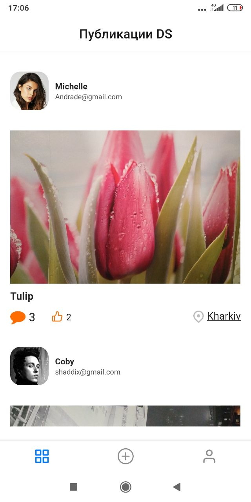
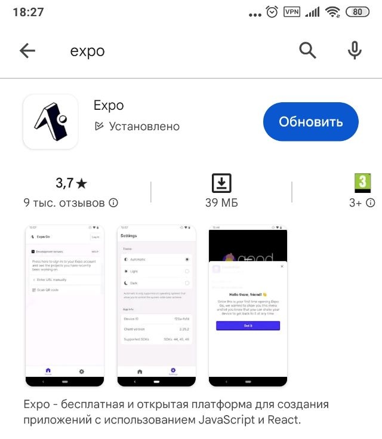
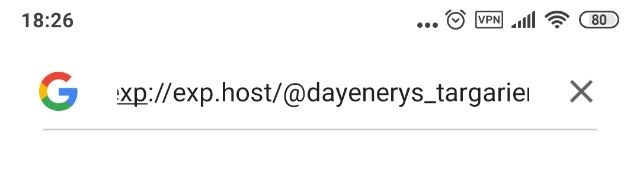

**Read in other languages: [English](README.md), 
[Русский](README.ru.md).**

# REACT-NATIVE-PROJECT
This project is app for mobile device

___

## Description

In this app, after your register or login, you can: see post another users, like and coment it ; make and publish your photo with your description and location.

___

   ### Technologyes that i used in this project:
  
  

  ___
  

### How to see this app on your device:
1. Download on your device "expo" app from _Google Play_ as like screenshot below:

2. copy this link:
`exp://exp.host/@dayenerys_targarien/React-Native-project?release-channel=default`     
>
3. add it in your Google search bar ( Not Chrome !) as like screenshot below:

4. You are already inside...
___

>
>
>
[back to the begining](#suda)